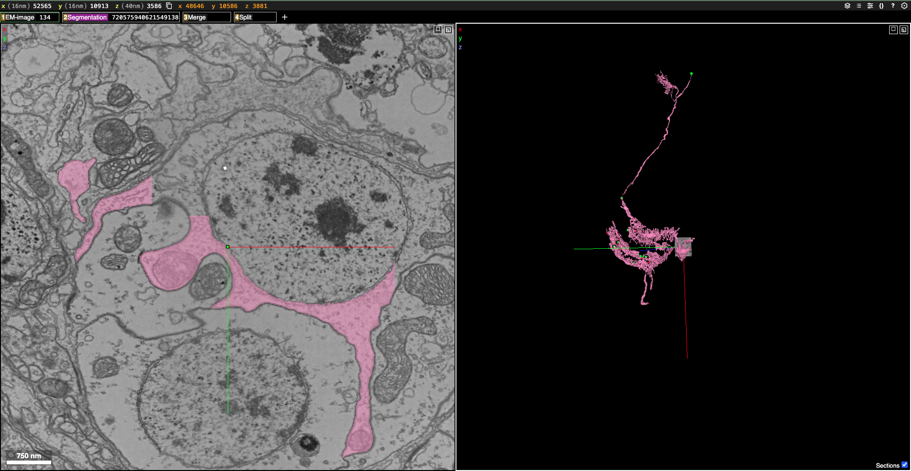
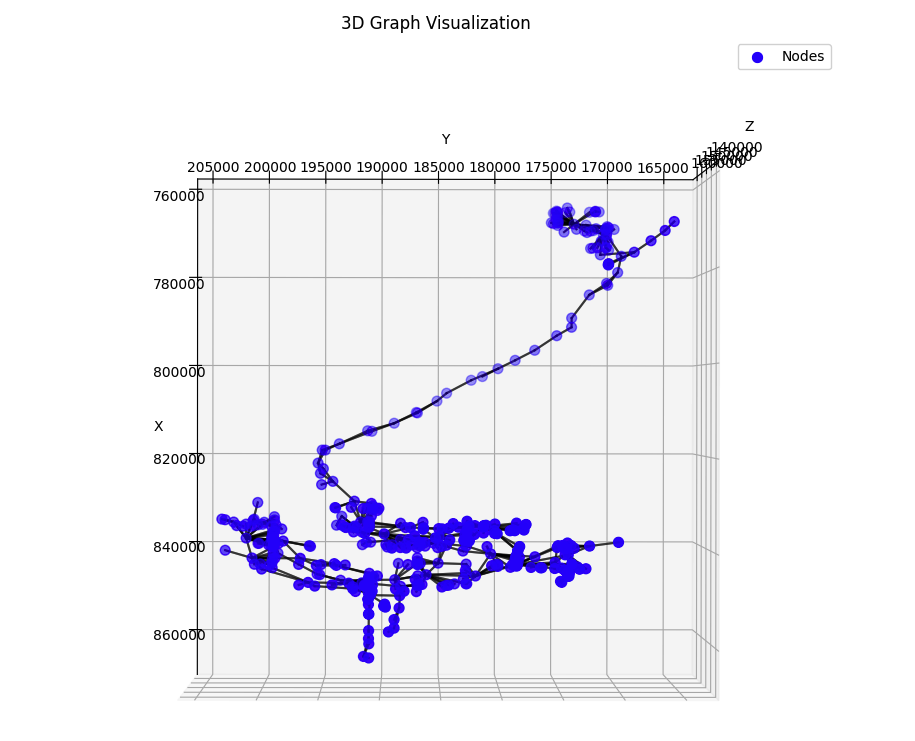

# NeurErrors 

This repository contains a Python class, `Dataset_Client`, designed to acquire and build graph datasets for past segment IDs in a chunked graph. The class provides functionalities for associating error coordinates with graph datasets and visualizing them in Neuroglancer.


## What this can do

- Acquire a graph dataset for a given segment ID
- Associate error coordinates with a graph dataset
- Visualize localization of errors in neuroglancer
- Associate operation weights to each operation in the graph dataset
Results: 

We can also associate errors with a given segment ID and visualize them in neuroglancer:


At the L2 resolution, we can have the graph visualization of the following:



## Installation

You need to install the required dependencies:

```bash
pip install -r requirements.txt
```

## Usage

```bash
pip install git+https://github.com/raphaellevisse/NeurErrors.git
```

An example of how to use the `Dataset_Client` class is provided in the `example.ipynb` file.

Dataset_Client constructor:

```python
class Dataset_Client():
    """
    A class to build a graph dataset of past IDs from a list of root IDs. Allows extension to datasets contained in the caveclient chunkedgraph.
    Can acquire independently from the graph dataset a dataset of the error coordinates for each segment ID by making a forward pass in the graph of operations.
    """
    def __init__(self, client: caveclient.CAVEclient = None):
        self.client = client
        if self.client:
            self.CG = self.client.chunkedgraph
        else:
            self.CG = None 
```

The dataset client has all the following methods:

## Class: `Dataset_Client`

### `__init__(self, client: caveclient.CAVEclient = None)`
Initializes the `Dataset_Client` with an optional `caveclient` instance.

**Arguments:**
- `client`: A `caveclient.CAVEclient` instance.

**Attributes:**
- `self.client`: Stores the `caveclient` instance.
- `self.CG`: Stores the chunked graph client.

---

### `verify_size(self, seg_id: int, treshold: int = 100, verbose: bool = False) -> bool`
Verifies if a given root ID has at least `threshold` leaves. Filters out isolated twigs.

---

### `build_old_id_dataset(self, ids: list[int], min_l2_size: int = 10, show_progress: bool = False, verbose: bool = False) -> list[int]`
Passes through each root ID and builds a dataset of all past IDs that have at least `min_l2_size` leaves.
**Arguments:**
- `ids`: List of root IDs.
- `min_l2_size`: Minimum number of leaves required for inclusion.

**Returns:**
- `root_to_old_seg_ids`: Dictionary mapping root IDs to past segment IDs.
- `old_seg_ids`: Flattened list of past segment IDs.

---

### `get_old_seg_ids_from_txt_file(self, input_path: str, min_l2_size: int = 10, show_progress: bool = False, verbose: bool = False) -> list[int]`
Builds a list of segment IDs from a file containing a comma-separated list of IDs. (e.g downloaded from Codex as a txt file)
Returns a dictionary of root IDs to list of old segment IDs and a list of old segment IDs indifferentiated by root ID.

**Arguments:**
- `input_path`: Path to the text file.
- `min_l2_size`: Minimum number of leaves required.

**Returns:**
- Same as `build_old_id_dataset`.

---

### `build_graph_dataset(self, seg_ids: list[int], attributes_list: list[str], save_path: str = None, intermediate_save: int = None, show_progress: bool = True, verbose: bool = False) -> list[Data]`
Builds a graph dataset from a list of segment IDs at the L2 level. Parsing the chunkedgraph tables to build the graph dataset.

**Arguments:**
- `seg_ids`: List of segment IDs.
- `attributes_list`: List of attributes to include.
- `save_path`: Optional path to save the dataset.

---

### `associate_error_to_graph_dataset(self, data: list[Data], voxel_resolution: np.ndarray = np.array([16, 16, 40]), save_path: str = None, show_progress: bool = True, verbose: bool = False) -> list[Data]`
Takes neurons as graphs and parses their future operations finding error locations found by Proofreaders. Associates error to closest L2 node.

**Arguments:**
- `data`: List of PyTorch Geometric graph data objects.
- `voxel_resolution`: Resolution of voxels used for error coordinate calculations. 
- `save_path`: Path to save the processed dataset. Default is None.
- `show_progress`: Whether to print progress details. Default is True.
- `verbose`: Whether to print progress details. Default is False.

**Returns:**
- `list[torch.PyG]`: Processed graph dataset with associated error data. 

---

### `build_error_dataset(self, seg_ids: list[int], voxel_resolution: np.ndarray = np.array([16, 16, 40]), show_progress: bool = True, verbose: bool = False) -> dict[int, np.ndarray]`
Builds a dataset of the error coordinates for each segment ID by making a forward pass in the graph of operations.

**Arguments:**
- `seg_ids`: list of segment IDs
- `voxel_resolution`: voxel resolution of the dataset
- `show_progress`: whether to print progress details
- `verbose`: whether to print verbose output

**Returns:**
- `dict[int, np.ndarray]`: dictionary of segment IDs to error features


---

### `get_url_for_visualization(self, seg_id: int, error_features: np.ndarray, em_data_url: str, segmentation_url: str, voxel_resolution: np.ndarray, local_host: bool, l2_nodes: torch.Tensor = None) -> str`
Returns a URL for visualization of a given segment ID in neuroglancer.demoappsot or local host.

**Arguments:**
- `seg_id`: segment ID
- `error_features`: error features. Numpy array of shape (num_nodes, 6) containing the error features for each node. x,y,z operation type, operation weight, operation id.
- `em_data_url`: URL of the EM data. Default is the FlyWire public data.
- `segmentation_url`: URL of the segmentation data. Default is the FlyWire public data.
- `voxel_resolution`: voxel resolution of the dataset, needed to go back from nm coordinates to voxel coordinates.
- `local_host`: whether to use the local host
- `l2_nodes`: node decisions. Tensor of shape (num_nodes, 1) containing the node decisions of the model. True or False.

**Returns:**
- `str`: URL for visualization of the segment ID

---

### `get_seg_ids_from_supervoxels(self, supervoxel_ids: list[int]) -> list[int]`
Returns a list of the most recent segment IDs from a list of supervoxel IDs.
Useful since supervoxels are immutable through time (except if resegmented). With this you can acquire the list of most recent segment IDs from a list of supervoxel IDs.
And then process this to build the graph/error dataset with build_old_id_dataset.

**Arguments:**
- `supervoxel_ids`: list of supervoxel IDs

**Returns:**
- `list[int]`: list of most recent segment IDs

---

### `test_dataset_integrity(self, data: list[Data]) -> bool`
Checks dataset validity by ensuring:
- No `NaN` values.
- No `0` values in `Data.x`.

**Arguments:**
- `data`: list of PyTorch Geometric graph data objects.

**Returns:**
- `bool`: True if valid, False otherwise.

---

### `normalize_features(self, data: list[Data], flywire_normalization: bool = True, total_mean: torch.Tensor, total_std: torch.Tensor)`
Normalizes dataset features to have zero mean and unit variance. Predefined values come from 20,000 neurons in the FlyWire dataset.

**Arguments:**
- `data`: list of PyTorch Geometric graph data objects.
- `flywire_normalization`: whether to use the FlyWire normalization
- `total_mean`: mean of the dataset
- `total_std`: standard deviation of the dataset

**Returns:**
- `list[Data]`: list of PyTorch Geometric graph data objects. In-place normalization.

---

### `denormalize_features(self, data: list[Data]) -> list[Data]`
Denormalizes dataset features to their original scale.  

**Arguments:**
- `data`: list of PyTorch Geometric graph data objects.

**Returns:**
- `list[Data]`: list of PyTorch Geometric graph data objects. In-place denormalization.

---

### `visualize_graph_3d(self, node_features: torch.Tensor, edge_index: torch.Tensor, error_features: torch.Tensor)`
Visualizes the graph in 3D using matplotlib.

**Arguments:**
- `node_features`: node features
- `edge_index`: edge index
- `error_features`: error features

**Returns:**
- `None`: Displays the 3D plot.


-- Model Training Functions

### `initialize_model(self, in_channels: int, hidden_channels: int, out_channels: int, pretrained_weights_path: str = None, device: str = "cuda" if torch.cuda.is_available() else "cpu") -> torch.nn.Module`
Initializes the model.

**Arguments:**
- `in_channels`: number of input channels
- `hidden_channels`: number of hidden channels  
- `out_channels`: number of output channels
- `pretrained_weights_path`: path to pretrained weights
- `device`: device to run the model on

**Returns:**
- `torch.nn.Module`: initialized model      

---

### `train_loop(self, train_loader, model, optimizer, criterion, device, lr=0.001, epochs=2000, save_path=None)`
Loop over the training data, updating the model parameters and calculating the loss.

**Arguments:**
- `train_loader`: data loader for training
- `model`: model to train
- `optimizer`: optimizer
- `criterion`: loss function
- `device`: device to run the model on
- `lr`: learning rate
- `epochs`: number of epochs to train
- `save_path`: path to save the model

**Returns:**
- `None`: Trains the model.

---

### `train_model(self, training_data: list[Data], criterion: torch.nn.Module = torch.nn.CrossEntropyLoss(reduction="none", weight=torch.tensor([1.0, 1.0], dtype=torch.float32)), validation_data: list[Data] = None, pretrained_weights_path: str = None, save_path: str = None, batch_size: int = 128, lr: float = 0.001, epochs: int = 2000, hidden_channels: int = 256, device: str = "cuda" if torch.cuda.is_available() else "cpu") -> torch.nn.Module`
Trains the model.   

**Arguments:**
- `training_data`: data loader for training
- `criterion`: loss function
- `validation_data`: data loader for validation
- `pretrained_weights_path`: path to pretrained weights
- `save_path`: path to save the model   
- `batch_size`: batch size
- `lr`: learning rate
- `epochs`: number of epochs to train
- `hidden_channels`: number of hidden channels
- `device`: device to run the model on

**Returns:**
- `torch.nn.Module`: trained model

---

### `model_inference(self, graph_dataset: list[Data], pretrained_weights_path: str, threshold: float = 0.5, hidden_channels: int = 256, batch_size: int = 32, out_channels: int = 2, device: str = "cuda" if torch.cuda.is_available() else "cpu", evaluate: bool = True) -> torch.Tensor`
Performs model inference on a list of data. Returns binary predictions of probabilities of error over threshold or not.

**Arguments:**
- `graph_dataset`: list of PyTorch Geometric graph data objects.
- `pretrained_weights_path`: path to pretrained weights
- `threshold`: threshold for the model
- `hidden_channels`: number of hidden channels
- `batch_size`: batch size
- `out_channels`: number of output channels
- `device`: device to run the model on
- `evaluate`: whether to evaluate the model

**Returns:**
- `torch.Tensor`: model predictions

---


# Example Full Pipeline

Below is an example pipeline for using `Dataset_Client` to process segment IDs, build graph datasets, associate errors, and run inference.

```python
import numpy as np
import caveclient
from dataset_client import Dataset_Client

if __name__ == "__main__":
    datastack_name = "flywire_fafb_public"
    operation_voxel_resolution = np.array([16, 16, 40])

    client = caveclient.CAVEclient(datastack_name)
    client.materialize.version = 783
    dataset_client = Dataset_Client(client)

    # Load segment IDs from a file or define manually
    # root_to_old_seg_ids, old_seg_ids = dataset_client.get_old_seg_ids_from_txt_file(input_path="neurerrors/data/seg_ids/ID_tests.txt", show_progress=True)
    # root_to_old_seg_ids, old_seg_ids = dataset_client.build_old_id_dataset([720575940625666796], min_l2_size=10, show_progress=True, verbose=False)
    old_seg_ids = [720575940620826450]  # Example of an old segment ID

    # Define attributes for L2 nodes
    attributes_list = ['rep_coord_nm', 'size_nm3', 'area_nm2', 'max_dt_nm', 'mean_dt_nm', 'pca_val']
    
    # Build graph dataset
    graph_dataset = dataset_client.build_graph_dataset(old_seg_ids, attributes_list, show_progress=True, verbose=False)

    # Associate error coordinates with the dataset
    dataset_client.associate_error_to_graph_dataset(graph_dataset, voxel_resolution=operation_voxel_resolution, show_progress=True)
    
    # Normalize features (precomputed mean and std for Flywire public dataset)
    dataset_client.normalize_features(graph_dataset, flywire_normalization=True)

    # Uncomment to train a new model
    # trained_model = dataset_client.train_model(graph_dataset, pretrained_weights_path="neurerrors/models/training/weights/19000-256-best-3_5.pt")

    # Perform model inference with a threshold of 0.5
    node_decisions = dataset_client.model_inference(
        [graph_dataset[0]], threshold=0.5, pretrained_weights_path="neurerrors/models/training/weights/19000-256-best-3_5.pt"
    )

    # Generate a Neuroglancer visualization URL
    predicted_l2_nodes = graph_dataset[0].l2_nodes[node_decisions]
    url = dataset_client.get_url_for_visualization(
        seg_id=graph_dataset[0].metadata['seg_id'], 
        error_features=graph_dataset[0].error_features, 
        voxel_resolution=operation_voxel_resolution, 
        local_host=True, 
        l2_nodes=predicted_l2_nodes
    )

    print(url)  # Output the Neuroglancer URL
```

## Acknowledgements

I would like to thank Sebastian Seung and the whole PNI and FlyWire team for their help and feedback on this project.


